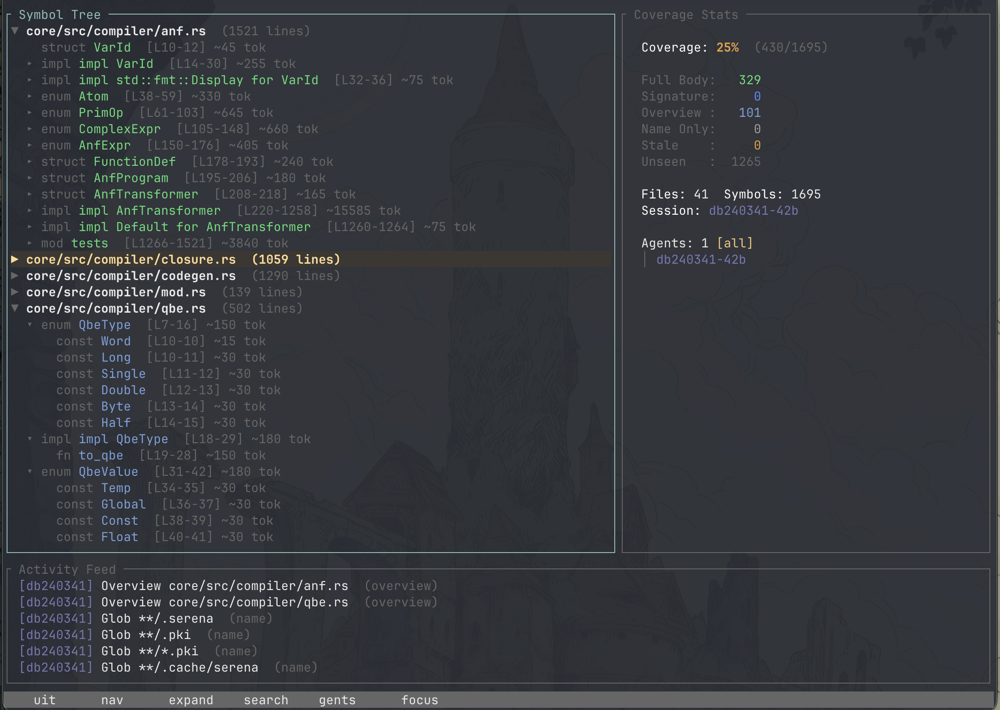

# ambits

When an AI coding agent works on your project, it reads files, greps for patterns, and inspects symbols — but you have no way to see what it actually looked at. **ambits** gives you that visibility.

It's a real-time TUI that watches Claude Code session logs and paints every function, struct, and class in your codebase by how deeply the agent has read it. At a glance you can see blind spots the agent missed, stale reads that are out of date, and exactly how much of your project the agent actually understands.



## Features

- **Real-time session monitoring** — Tails Claude Code's JSONL session logs as the agent works, updating the display live
- **Depth-aware coverage** — Every symbol is color-coded by read depth: unseen, name-only, overview, signature, or full body
- **Staleness detection** — When source files change on disk, previously-read symbols are automatically marked stale so you know what needs a re-read
- **Coverage reports** — Generate tabular per-file coverage summaries for CI or quick audits
- **Sortable tree view** — Toggle between alphabetical and coverage-grouped ordering to surface partially-covered files first
- **Multiple parsing backends** — Tree-sitter for fast local parsing, or [Serena MCP](https://github.com/oraios/serena) for richer LSP-based symbol data across more languages

## Supported Languages

| Backend | Languages |
|---|---|
| Tree-sitter | Rust, Python |
| Serena MCP | Any language Serena supports |

## Roadmap

- Multi-agent hierarchy visualization
- Multi-session comparison

## Building from source

Requires Rust 1.70+.

```
cargo build --release
```

## Installing through Cargo

```
cargo install ambits
```

## Usage

```
ambits --project <path>
```

### Flags

| Flag | Description |
|---|---|
| `--project`, `-p` | Path to the project root (required) |
| `--session`, `-s` | Session ID to track (auto-detects latest) |
| `--dump` | Print symbol tree to stdout and exit |
| `--coverage` | Print coverage report to stdout and exit |
| `--serena` | Use Serena's LSP symbol cache instead of tree-sitter |
| `--log-dir` | Path to Claude Code log directory (auto-derived) |
| `--log-output` | Output directory for event logs |

### Examples

```bash
# Launch TUI for current project
ambits -p .

# Dump symbol tree without TUI
ambits -p . --dump

# Print coverage report
ambits -p . --coverage

# Use Serena's symbol cache (more languages, finer detail)
ambits -p . --serena
```

### Coverage Report

The `--coverage` flag prints a per-file breakdown of how much the agent has seen, useful for quick audits or piping into CI checks:

```
Coverage Report (session: 34e212cf-a176-4059-ba12-eca94b56e43b)
─────────────────────────────────────────────────────────────────────────────
File                                      Symbols    Seen    Full   Seen%   Full%
─────────────────────────────────────────────────────────────────────────────
src/events.rs                                   3       0       0      0%      0%
src/parser/mod.rs                               8       8       1    100%     12%
src/app.rs                                     23      23      23    100%    100%
─────────────────────────────────────────────────────────────────────────────
TOTAL                                         214     182     175     85%     82%
```

- **Seen%**: Symbols the agent has any awareness of (name, overview, signature, or full body)
- **Full%**: Symbols the agent has read completely (full body)

## Claude Code Skill

ambits includes a [Claude Code skill](https://code.claude.com/docs/en/skills) so you can check coverage without leaving your editor. Type `/ambit` in any Claude Code session to get an instant coverage summary.

### Installing the skill

```bash
# Install globally (available in all your projects)
ambits skill install --global

# Install into the current project only
ambits skill install

# Install into a specific project
ambits skill install --project /path/to/project
```

Global installs go to `~/.claude/skills/ambit/`. Project installs go to `.claude/skills/ambit/` within the target directory.

### Using the skill

Once installed, use `/ambit` in Claude Code:

```
/ambit                    # Check coverage for current project
/ambit --session <id>     # Check a specific session
```

Claude will run the appropriate `ambits` commands and interpret the coverage results, highlighting blind spots and suggesting files to read for better understanding.

### Keybindings

| Key | Action |
|---|---|
| `j` / `k` | Navigate up/down |
| `h` / `l` | Collapse/expand |
| `Enter` | Toggle expand |
| `/` | Search symbols |
| `s` | Toggle sort (alphabetical / coverage) |
| `a` | Cycle agent filter |
| `Tab` | Switch panel focus |
| `q` | Quit |

### Color Legend

**Symbol colors** (by read depth):

| Color | Meaning |
|---|---|
| Dark gray | Unseen |
| Light gray | Name only (appeared in glob/listing) |
| Pale blue | Overview (grep match, symbol listing) |
| Blue | Signature seen |
| Green | Full body read |
| Orange | Stale (source changed since last read) |

**File header colors** (by coverage status):

| Color | Meaning |
|---|---|
| White | No symbols read at full body depth |
| Amber | Partially covered (some symbols read fully) |
| Green | Fully covered (all symbols read at full body depth) |
